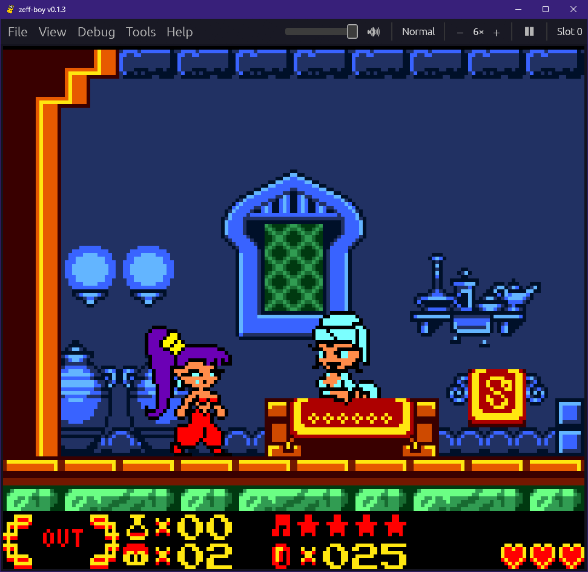
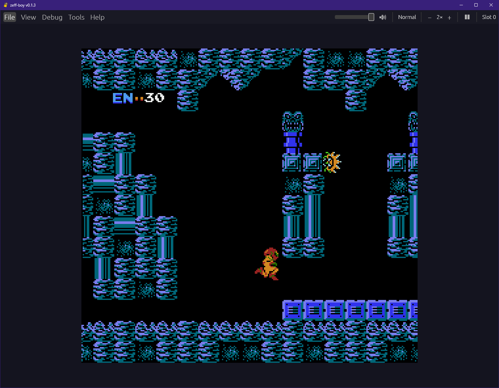
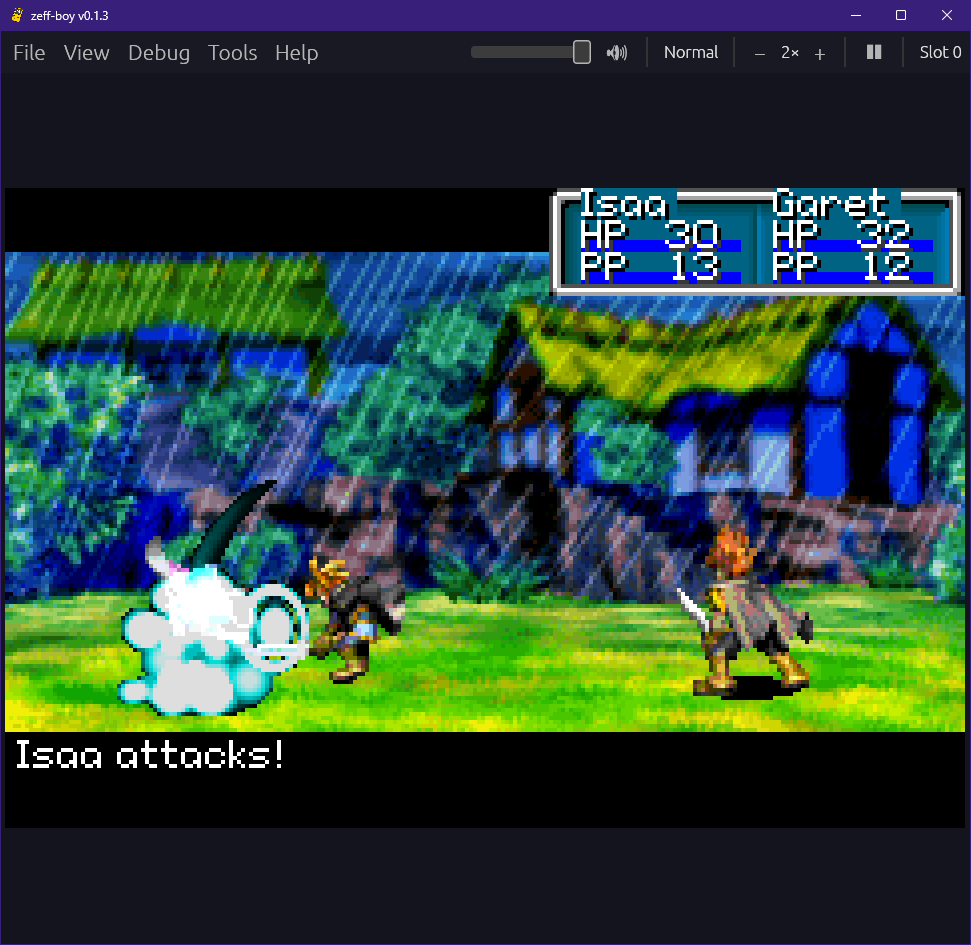
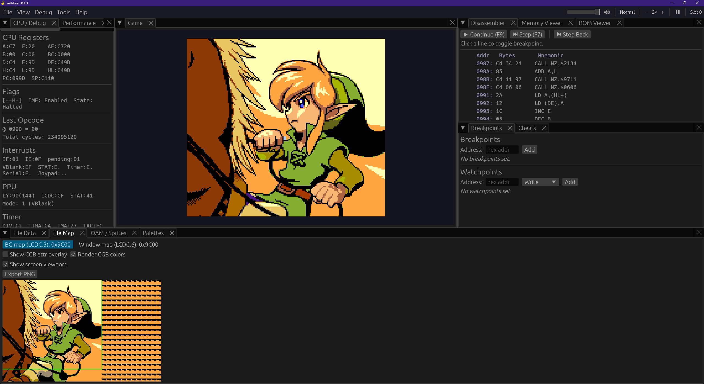

# Zeff-Boy

**Zeff-Boy** is a Game Boy, Game Boy Color, Game Boy Advance, NES, WonderSwan, and Sega 8-bit emulator written in Rust.
I've mainly started this project to help me learn about low level programming and emulation.

Oh and I like making cool shit.

   

## License

Licensed under either of:

* Apache License, Version 2.0 ([LICENSE-APACHE](LICENSE-APACHE) or http://www.apache.org/licenses/LICENSE-2.0)
* MIT license ([LICENSE-MIT](LICENSE-MIT) or http://opensource.org/licenses/MIT)

at your option.

### Contribution

Unless you explicitly state otherwise, any contribution intentionally submitted
for inclusion in the work by you, as defined in the Apache-2.0 license, shall
be dual-licensed as above, without any additional terms or conditions.
